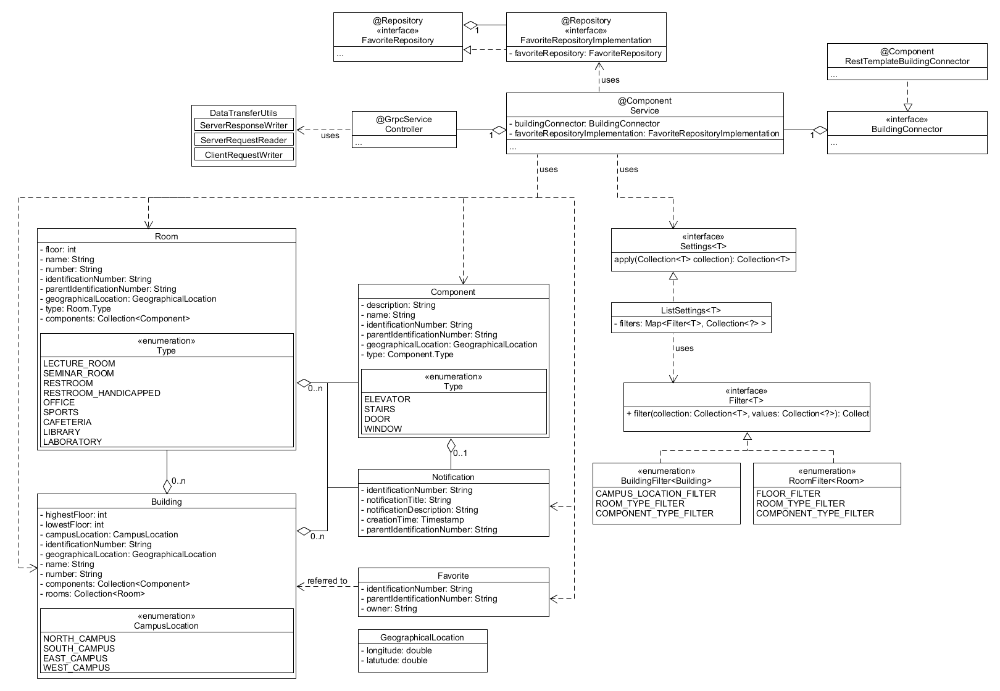

# BuildingManagement Class Diagram

This class diagram is split into three parts: building, controller and filter. The building, which is being described
more precisely
in [Building](https://git.scc.kit.edu/cm-tm/cm-team/3.projectwork/pse/domain/building/-/blob/dev/pages/bounded_context_entity_relation_view.md)
,
contains the construction of a building with its rooms, components and notifications. The api is controlled by a
controller, which uses a service to compute
operations and a connector to retrieve data from the domain service. Some classes are not shown in this diagram, since
they were not necessary for the project
itself and only covered configurations and errorhandling.

A description of the identification number called "identificationNumber", "referenceIdentificationNumber" or "
parentIdentificationNumber" in this diagram can be found in
the [Ubiquitous Language](https://git.scc.kit.edu/-/ide/project/cm-tm/cm-team/3.projectwork/pse/docsc/tree/english-translation/-/pages/ubiquitous_language.md/)
.
