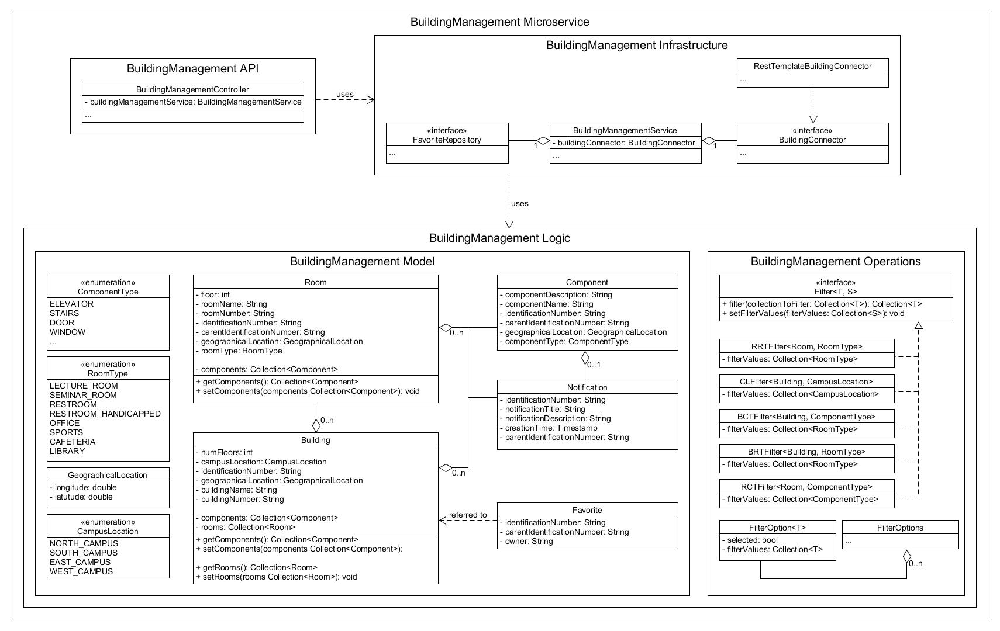

# BuildingManagement Class Diagram

A description of the identification number called "identificationNumber", "referenceIdentificationNumber" or "
parentIdentificationNumber" in this diagram can be found in
the [Ubiquitous Language](https://git.scc.kit.edu/-/ide/project/cm-tm/cm-team/3.projectwork/pse/docsc/tree/english-translation/-/pages/ubiquitous_language.md/)
.
