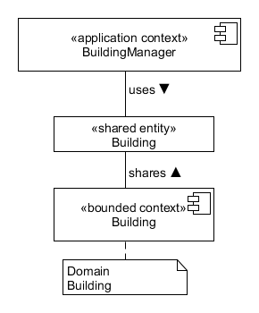

# BuildingManagent Sharing View

The BuildingManagement microservice uses the building domain microservice to provide building specific services. Services share their entities with the application belonging to the BuildingManager.

