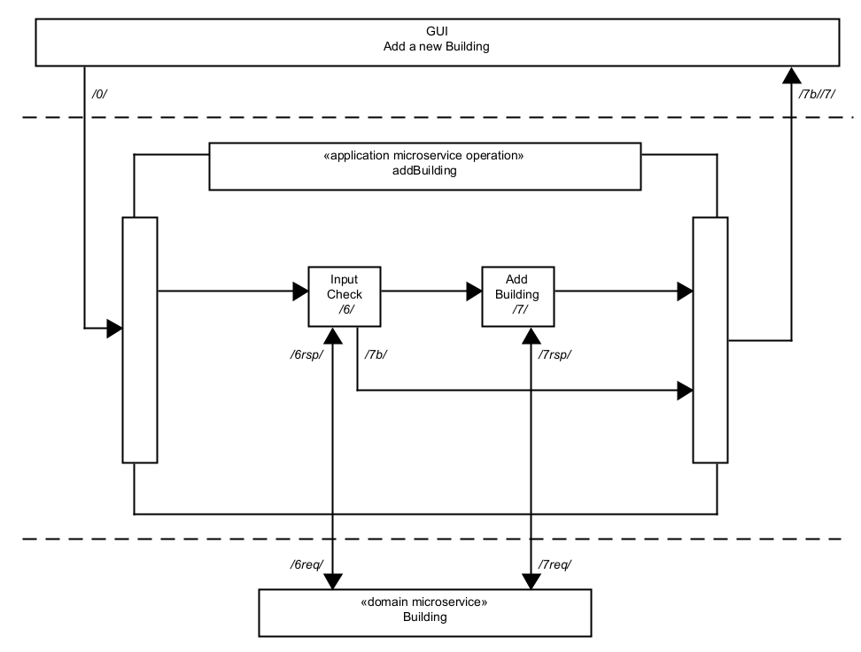
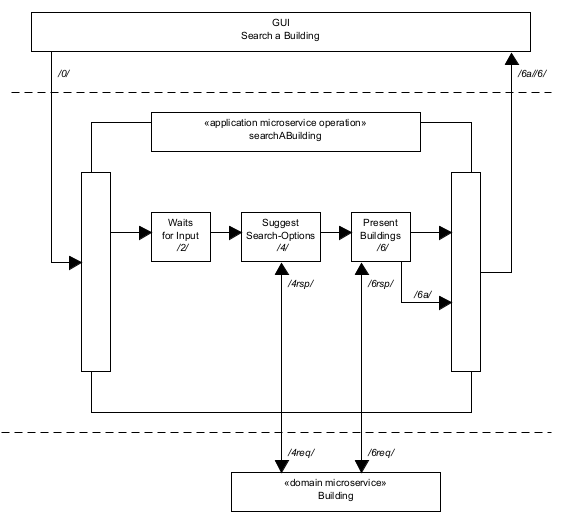
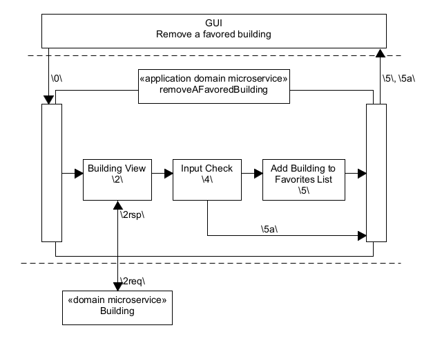

# Task Processes

In the following examples, are procedures for this microservice, they display its connection and coworking with domain microservices, frontend and their data exchange.

## Application Microservice **`BuildingManagement`** 

- [Add a new Building](#add-a-new-building)

- [Remove a Building](#remove-a-building)

- [Add Building Information](#add-building-information)

- [Edit Building Information](#edit-building-information)

- [Remove Building Information](#remove-building-information)

- [Search a Building](#search-a-building)

- [Filter a Building](#filter-a-building)

- [Retrieve Building Information](#retrieve-building-information)

- [View the Map](#view-the-map)

- [Add a favored Building](#add-a-favored-building)

- [Search a favored Building](#search-a-favored-building)

- [Remove a favored Building](#remove-a-favored-building)

### Add a new Building

### Remove a Building

### Add Building Information

### Edit Building Information

### Remove Building Information

### Search a Building

### Filter a Building

### Retrieve Building Information

### View the Map

### Add a favored Building

### Search a favored Building

### Remove a favored Building

